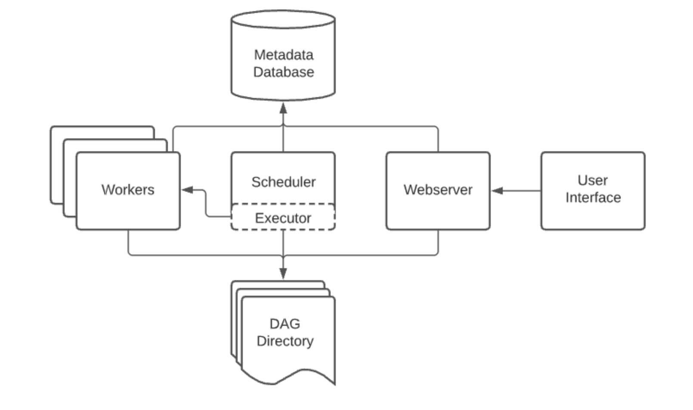
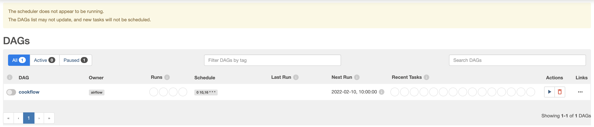
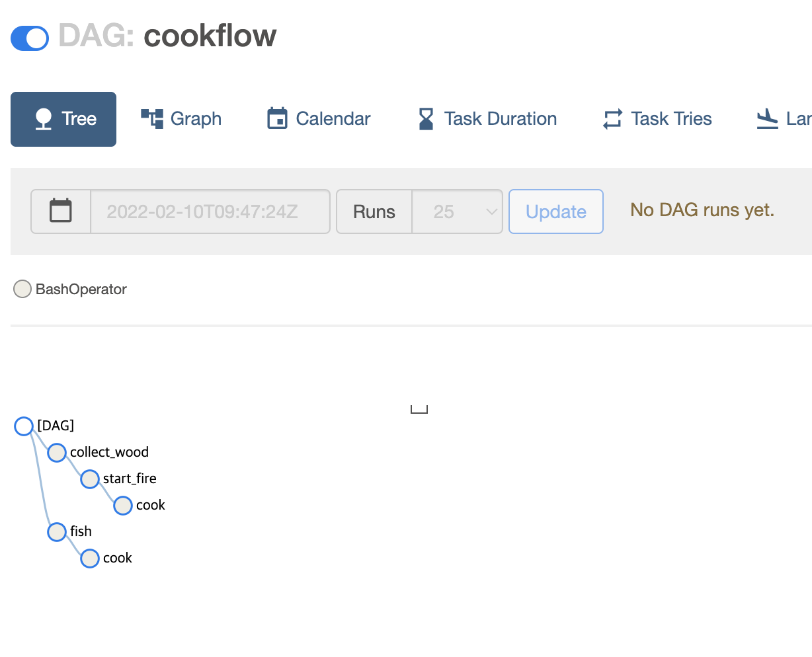

# Airflow를 활용한 ETL 프로세스 설계

전체적인 진행과정은 노션에서 확인할 수 있습니다: https://onyx-bandicoot-bec.notion.site/MLOps-AIRFLOW-ETL-6ee19fa8779c4d5da2f54a58170dc818  

## 개요
Python기반의 Airflow를 활용해 효율적인 ETL 작성 및 관리를 하고  
데이터 파이프라인 하나의 단위인 DAG를 통해 task를 구현하는 side project

## 프로젝트 기간 
2022.02.09 ~ 2022.02.

## 사용기술
- Language : Python 3.7  
- DB : Airflow webserver(SQLite), PostgreSQL  
- Infra : Apache Airflow  

## 수행역할 
Apache Airflow를 사용하여 Workflow를 작성하고 스케줄링하며 모니터링하는 ETL 설계
- Apache Airflow 이해 & 설치 및 사용환경 구축
- Airflow DAG 안에 tssk 생성 및 스케줄링
- Airflow Webserver UI를 활용한 모니터링
- SequentialExecutor 사용을 위한 Airflow DB 변경 : Sqlite -> PostgreSQL

## 아키텍쳐  
### Apache Airflow 구조

## 프로젝트 결과 
1. Exam DAG Graph

2. Exam DAG tree

3. Airflow DB 변경 결과 (PostgreSQL)

